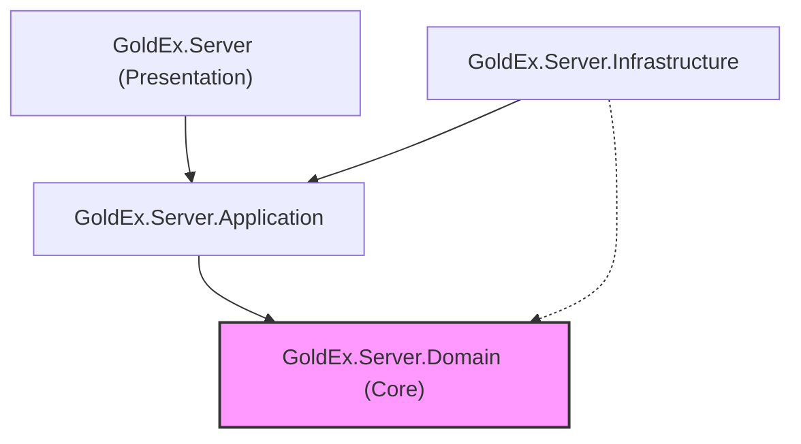

# GoldEx - Smart Jewelry Store Management System

[](https://opensource.org/licenses/MIT)
[](https://dotnet.microsoft.com/en-us/platform/get-started/get-10-sdk)
[](https://dotnet.microsoft.com/en-us/apps/aspnet/web-apps/blazor)
[](https://mudblazor.com/)
[](https://en.wikipedia.org/wiki/Domain-driven_design)

GoldEx is a comprehensive, modern jewelry store management, gold sales, and accounting solution. Adhering to Domain-Driven Design (DDD) principles and built with .NET 10, MudBlazor, and Blazor WebAssembly, GoldEx offers a highly performant, scalable, and secure platform tailored specifically to the unique needs of the gold and jewelry industry.

> [!NOTE]
> This project is currently under active development. Features and functionality are subject to change.

---

## Applications in the Solution

The GoldEx solution contains **two distinct applications** designed to cover different operational requirements:

### 1. GoldEx (Main Enterprise Web App)
The primary management system designed for complete jewelry store operations. It runs as a Blazor WebAssembly application in Auto Render Mode (featuring server prerendering). It supports comprehensive inventory management, advanced pricing engines, multi-currency invoicing, automated double-entry gold accounting, and deep reporting.

### 2. GoldEx Mini (Offline Sales & Calculation App)
An extremely fast, lightweight client-side application designed to run completely offline (requiring internet access only once during PWA installation and the initial price fetch). All calculation data, invoice baskets, and invoice history are stored directly on the user's device using local storage (`LocalStorage`), offering high speed, privacy, and independence from a remote server.

---

## Key Features & Capabilities

### 1. Real-Time Rate & Pricing Engine
* **Live Market Monitoring:** View real-time online rates for various gold types (cast gold, 18K, 24K), precious metals (platinum, palladium), coins (Emami, Bahar Azadi, half, quarter, gram coins), silver, and common currencies.
* **Configure Providers:** Support for connecting to multiple pricing sources and setting provider priority to ensure accurate market valuations.

### 2. Advanced Computational Engine
* **Multi-Purpose Calculations:** Automated price calculations for cast gold, jewelry items, gemstones, and scrap/used gold using precise industry-standard formulas.
* **Reverse Gold Calculator:** Instantly calculate how much gold (in grams) can be purchased for a specific fiat budget based on the live market rate.
* **Instant Scanning & Pricing:** Scan barcodes using a smartphone camera or barcode scanner to instantly display item details, weights, and current prices.
* **Showcase Search:** Quickly retrieve and display the latest prices of all items in the showcase or inventory in one place.

### 3. Inventory & Stock Management
* **Supply Chain Control:** Manage stock inflow and outflow via purchase and sales invoices (supporting retail and wholesale).
* **Melting Operations:** Record cast gold from melting processes and accurately track gold loss/shrinkage after assay evaluation.
* **Item Barcoding:** Print custom barcodes and dedicated item codes for precise automated inventory tracking.

### 4. Smart Invoices & Customer Management
* **Multi-Currency Invoices:** Generate official and unofficial invoices with multiple currencies in the same transaction.
* **Template Customization:** Design and print customized invoice layouts aligned with the store's brand.
* **Account Statement Tracking:** Automatic calculation and display of customer balances (both gold weight and fiat currency) on invoices, with comprehensive ledger histories.
* **Flexible Settlement:** Record invoice settlements using multiple methods (checks, transfers, cash, or various gold trade-ins).

### 5. Automated Gold Accounting
* **Zero Manual Journals:** Fully automated, compliant double-entry gold accounting. The system automatically creates transactions, ledger accounts, and reports behind the scenes.
* **Multiple Cashboxes:** Maintain distinct cashboxes for Rial, foreign currencies, and physical gold weights to track store funds accurately.

### 6. GoldEx Mini (Offline-First Features)
* **Offline Calculations:** Instant calculations for cast gold and used gold purchases (with workmanship deductions) without an internet connection.
* **Local Invoice Management:** Maintain an invoice basket (add, edit, or delete items) and issue invoices instantly.
* **Standard A5 Printing:** Print optimized, professional A5 landscape invoices containing daily rates, workmanship, and final calculations.
* **Device History:** Retrieve and reprint the local history of invoices archived directly inside the device's storage.

---

## Technical Stack

* **Framework:** .NET 10.0 (ASP.NET Core & Blazor WebAssembly)
* **UI Library:** MudBlazor 9.5.0 (Material Design for Blazor)
* **Architecture:** Domain-Driven Design (DDD), Clean Architecture
* **ORM & Database:** Entity Framework Core 10.0 with Microsoft SQL Server
* **Offline Storage:** LocalStorage (for GoldEx Mini's offline state and invoice archives)
* **Logging:** Serilog with Microsoft SQL Server sink and a built-in Serilog.UI admin dashboard
* **Reporting:** DevExpress Blazor Reporting (JS-based WebAssembly controls)
* **Barcode & Scanning:** ZXingBlazor for scanning and Net.Codecrete.QrCodeGenerator for barcode generation
* **Rich Text Editing:** TinyMCE (via TinyMCE.Blazor)
* **Object Mapping:** Mapster
* **Monitoring:** ASP.NET Core Health Checks (SQL Server, URI, and UI Dashboard)
* **Deployment:** Docker support with Linux container integration

---

## Solution Project Structure

The project structure is organized according to the logical architecture of the system as defined in [GoldEx.slnx](file:///d:/source/GoldEx/GoldEx.slnx):

```
GoldEx/
├── 1. App/
│   ├── 1. Server/
│   │   ├── GoldEx.Server/               # ASP.NET Core Web API host, endpoints, & Docker support
│   │   ├── GoldEx.Server.Application/   # Application use cases, business logic, & background services
│   │   ├── GoldEx.Server.Domain/        # Core business domain models, entities, events, & rules
│   │   └── GoldEx.Server.Infrastructure/# Data access (EF Core), external integrations, & security
│   ├── 2. Client/
│   │   ├── GoldEx.Client/               # Main Blazor WASM client entry, routing, & service worker
│   │   ├── GoldEx.Client.Abstractions/  # Client interface contracts and ViewModels
│   │   ├── GoldEx.Client.Components/    # Reusable Blazor UI components built with MudBlazor
│   │   └── GoldEx.Client.Services/      # API communication, HTTP clients, & state services
│   └── 3. Shared/
│       └── GoldEx.Shared/               # DTOs, common models, validation, & shared utilities
├── 2. Calculator/ (GoldEx Mini)
│   ├── 1. Server/
│   │   └── GoldEx.Calculator.Server/    # Minimal backend host for the Calculator app
│   ├── 2. Client/
│   │   └── GoldEx.Calculator.Client/    # Blazor WASM client for the offline GoldEx Mini app
│   └── 3. Shared/
│       └── GoldEx.Calculator.Shared/    # Common models & DTOs specific to the Calculator app
├── 3. Sdk/
│   ├── GoldEx.Sdk.Client/               # Client-side SDK wrapper for communicating with GoldEx API
│   ├── GoldEx.Sdk.Common/               # Shared SDK contracts, utilities, & configurations
│   └── GoldEx.Sdk.Server/               # Server-side SDK integration libraries
└── 4. Tests/
    └── GoldEx.Tests.Server/             # Server unit and integration tests
```

---

## Architectural Design & Layer Management

GoldEx is designed using **Clean Architecture** and **Domain-Driven Design (DDD)** principles. The dependency flow is strictly unidirectional, pointing inwards toward the Core Domain. This decouples the core business logic from database systems, web frameworks, and external services, ensuring high maintainability and testability.



### 1. Core Domain Layer (`GoldEx.Server.Domain`)
* **Role:** The heart of the application, capturing the core business rules and concepts of the jewelry industry.
* **Key Components:**
  * **Aggregates & Entities:** Business objects with identity and lifecycle boundaries (e.g., `InvoiceAggregate`, `ProductAggregate`, `CustomerAggregate`, `TransactionAggregate`).
  * **Value Objects:** Description concepts without unique identities (e.g., gold weights, price units, monetary amounts).
  * **Domain Events:** Side-effects and events triggered by state changes.
  * **Abstractions:** Repository interfaces (e.g., `ICustomerRepository`), database transactions, and specifications defining database queries.
* **Management:** Strictly self-contained. It contains zero references to external frameworks, UI logic, or specific databases (like SQL Server or EF Core).

### 2. Application Layer (`GoldEx.Server.Application`)
* **Role:** Orchestrates the flow of data and execution of business use cases.
* **Key Components:**
  * **Application Services:** Orchestrates business operations and validation flow.
  * **Validators:** Data validation logic (utilizing FluentValidation/custom validators).
  * **Background Services:** Asynchronous operations, such as background pricing synchronization engines.
  * **Seeders & Utilities:** System bootstrap tasks and general data format helper utilities.
* **Management:** Operates purely on the interfaces/abstractions defined in the Domain layer, completely decoupled from presentation and infrastructure technologies.

### 3. Infrastructure Layer (`GoldEx.Server.Infrastructure`)
* **Role:** Implements the interfaces and specifications defined in the Domain and Application layers to connect with physical infrastructure.
* **Key Components:**
  * **Data Access (`GoldExDbContext`):** Entity Framework Core configurations and entity state persistence mapping.
  * **Concrete Repositories:** Physical data access implementation of repositories mapping queries to SQL Server.
  * **Specifications Execution:** Combines and compiles domain specifications into optimized LINQ-to-Entities database queries.
  * **External Services:** Concrete SMS gateway integrations, currency/gold rate API adapters, and local document generation implementations.
* **Management:** Contains references to external libraries, packages (like Serilog, EF Core), and configuration bindings. It acts as the pipeline supplying technical solutions to the domain's abstract requirements.

### 4. Presentation / API Layer (`GoldEx.Server`)
* **Role:** The Web API Host, serving as the entry point and presentation layer of the backend application.
* **Key Components:**
  * **Controllers:** Standard ASP.NET Core API endpoints handling incoming HTTP requests.
  * **Authentication:** Setup for ASP.NET Core Identity, Google Auth, 2FA, and passkeys.
  * **Dependency Injection:** Centralized registry wire-up (`DependencyInjection.cs`) resolving and mapping concrete Infrastructure classes to Domain/Application interfaces.
  * **Hosting:** Docker/Linux target packaging, middleware configurations, and API documentation (Swagger/Swashbuckle).

---

## Contributing

Contributions are welcome! Please open an issue or submit a pull request. See `CONTRIBUTING.md` for more details (create this file if you wish to accept contributions).

---

## License

This project is licensed under the MIT License - see the [LICENSE.txt](file:///d:/source/GoldEx/LICENSE.txt) file for details.

---

## Contact

For any questions or inquiries, please contact:

**Masoud Khodadadi**  
Email: masoud.xpress@gmail.com  
GitHub: [urmiaking](https://github.com/urmiaking)
